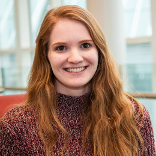
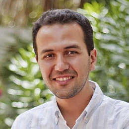

# Faculty

{::nomarkdown}
{:/nomarkdown}
{: .profile-img}
### [<i class="fa fa-link" aria-hidden="true"></i> Dr. Cayelan Carey](http://www.carey.biol.vt.edu/){: .clear-both}
{::nomarkdown}
{:/nomarkdown}
Associate Professor, Carey Lab, Department of Biological Sciences, Virginia Tech
{::nomarkdown}

{:/nomarkdown}

{::nomarkdown}
{:/nomarkdown}
{: .profile-img}
### [<i class="fa fa-link" aria-hidden="true"></i> Dr. Michael Sorice](https://www.sorice.frec.vt.edu/){: .clear-both}
{::nomarkdown}
{:/nomarkdown}
Assistant Professor, Department of Forest Resources & Environmental Conservation, Virginia Tech
{::nomarkdown}

{:/nomarkdown}

{::nomarkdown}
{:/nomarkdown}
{: .profile-img}
### [<i class="fa fa-link" aria-hidden="true"></i> Dr. Quinn Thomas](https://www.epics.frec.vt.edu/){: .clear-both}
{::nomarkdown}
{:/nomarkdown}
Associate Professor, Department of Forest Resources & Environmental Conservation, Virginia Tech
{::nomarkdown}

{:/nomarkdown}

{::nomarkdown}
{:/nomarkdown}
{: .profile-img}
### [<i class="fa fa-link" aria-hidden="true"></i> Dr. Francois Birgand](https://francoisbirgand.github.io/)
{::nomarkdown}
{:/nomarkdown}
Assistant Professor, Department of Biological & Agricultural Engineering, North Carolina State University
{::nomarkdown}

{:/nomarkdown}

{::nomarkdown}
{:/nomarkdown}
{: .profile-img}
### [<i class="fa fa-link" aria-hidden="true"></i> Dr. Renato Figueiredo](https://www.acis.ufl.edu/people/renatof)
{::nomarkdown}
{:/nomarkdown}
Professor, ACIS Lab, Department of Electrical & Computer Engineering, University of Florida
{::nomarkdown}

{:/nomarkdown}

{::nomarkdown}
{:/nomarkdown}
{: .profile-img}
### [<i class="fa fa-link" aria-hidden="true"></i> Dr. John Little](http://www.globalchange.vt.edu/john-little/)
{::nomarkdown}
{:/nomarkdown}
Professor, Department of Civil & Environmental Engineering, Virginia Tech
{::nomarkdown}

{:/nomarkdown}

{::nomarkdown}
{:/nomarkdown}
{: .profile-img}
### [<i class="fa fa-link" aria-hidden="true"></i> Dr. Madeline Schreiber](https://www.globalchange.vt.edu/madeline-schreiber/)
{::nomarkdown}
{:/nomarkdown}
Professor, Department of Geosciences, Virginia Tech
{::nomarkdown}

{:/nomarkdown}

{: .clear-both}

# Researchers, Technician, Alumni, & Students

{::nomarkdown}
{:/nomarkdown}
{: .profile-img}
### [<i class="fa fa-link" aria-hidden="true"></i> Dr. Paul Hanson](http://hanson.limnology.wisc.edu/)
{::nomarkdown}
{:/nomarkdown}
Distinguished Professor of Research, Center for Limnology, University of Wisconsin-Madison
{::nomarkdown}

{:/nomarkdown}

{::nomarkdown}
{:/nomarkdown}
{: .profile-img}
### [<i class="fa fa-link" aria-hidden="true"></i> Dr. Alexandria Hounshell](https://www.carey.biol.vt.edu/?page_id=1513)
{::nomarkdown}
{:/nomarkdown}
Postdoctoral Researcher, Carey Lab, Department of Biological Sciences, Virginia Tech
{::nomarkdown}

{:/nomarkdown}

{::nomarkdown}
{:/nomarkdown}
{: .profile-img}
### [<i class="fa fa-link" aria-hidden="true"></i> Bethany Bookout](https://www.carey.biol.vt.edu/?page_id=1293)
{::nomarkdown}
{:/nomarkdown}
Research Technician, Carey Lab, Department of Biological Sciences, Virginia Tech
{::nomarkdown}

{:/nomarkdown}

{::nomarkdown}
{:/nomarkdown}
{: .profile-img}
### [<i class="fa fa-link" aria-hidden="true"></i> Mary Lofton](http://www.globalchange.vt.edu/mary-lofton/)
{::nomarkdown}
{:/nomarkdown}
PhD Student, Carey Lab, Department of Biological Sciences, Virginia Tech
{::nomarkdown}

{:/nomarkdown}

{::nomarkdown}
{:/nomarkdown}
{: .profile-img}
### [<i class="fa fa-link" aria-hidden="true"></i> Ryan McClure](http://www.globalchange.vt.edu/ryan-mcclure/)
{::nomarkdown}
{:/nomarkdown}
PhD Student, Carey Lab, Department of Biological Sciences, Virginia Tech
{::nomarkdown}

{:/nomarkdown}

{::nomarkdown}
{:/nomarkdown}
{: .profile-img}
### [<i class="fa fa-link" aria-hidden="true"></i> Heather Wander](https://carey.biol.vt.edu/?page_id=1520)
{::nomarkdown}
{:/nomarkdown}
PhD Student, Carey Lab, Department of Biological Sciences, Virginia Tech
{::nomarkdown}

{:/nomarkdown}

{::nomarkdown}
{:/nomarkdown}
{: .profile-img}
### [<i class="fa fa-link" aria-hidden="true"></i> Abigail Lewis](https://carey.biol.vt.edu/?page_id=1525)
{::nomarkdown}
{:/nomarkdown}
PhD Student, Carey Lab, Department of Biological Sciences, Virginia Tech
{::nomarkdown}

{:/nomarkdown}

{::nomarkdown}
{:/nomarkdown}
{: .profile-img}
### [<i class="fa fa-link" aria-hidden="true"></i> Vahid Daneshmand](https://www.acis.ufl.edu/people/vdaneshmand)
{::nomarkdown}
{:/nomarkdown}
PhD Student, ACIS Lab, Department of Electrical & Computer Engineering, University of Florida
{::nomarkdown}

{:/nomarkdown}

{::nomarkdown}
{:/nomarkdown}
{: .profile-img}
### [<i class="fa fa-link" aria-hidden="true"></i> Madeline Grupper](https://www.sorice.frec.vt.edu/maddy-grupper/)
{::nomarkdown}
{:/nomarkdown}
Master's Student, Conservation Social Science Lab, Virginia Tech
{::nomarkdown}

{:/nomarkdown}

{::nomarkdown}
{:/nomarkdown}
{: .profile-img}
### [<i class="fa fa-link" aria-hidden="true"></i> Whitney Woelmer](https://www.carey.biol.vt.edu/?page_id=1289)
{::nomarkdown}
{:/nomarkdown}
PhD Student, Carey Lab, Department of Biological Sciences, Virginia Tech
{::nomarkdown}

{:/nomarkdown}

{::nomarkdown}
{:/nomarkdown}
{: .profile-img}
### [<i class="fa fa-link" aria-hidden="true"></i> Dexter Howard](https://twitter.com/dexterhoward77?lang=en)
{::nomarkdown}
{:/nomarkdown}
PhD Student, Carey Lab, Department of Biological Sciences, Virginia Tech
{::nomarkdown}

{:/nomarkdown}

{::nomarkdown}
{:/nomarkdown}
{: .profile-img}
### [<i class="fa fa-link" aria-hidden="true"></i> Laura Puckett](https://www.epics.frec.vt.edu/?page_id=65)
{::nomarkdown}
{:/nomarkdown}
Undergraduate Alumni (VT '19), Ecosystem Dynamics & Forecasting Lab, Virginia Tech
{::nomarkdown}

{:/nomarkdown}

{::nomarkdown}
{:/nomarkdown}
{: .profile-img}
### [<i class="fa fa-link" aria-hidden="true"></i> Arianna Krinos](https://github.com/akrinos)
{::nomarkdown}
{:/nomarkdown}
Undergraduate Alumni (VT '19), Carey Lab, Department of Biological Sciences, Virginia Tech
{::nomarkdown}

{:/nomarkdown}