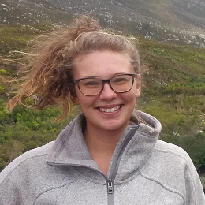

# Faculty

{::nomarkdown}

{:/nomarkdown}
{: .profile-img}
### [Dr. Cayelan Carey <i class="fa fa-link"></i>](http://www.carey.biol.vt.edu/){: .clear-both}

Associate Professor, Carey Lab, Department of Biological Sciences, Virginia Tech
{::nomarkdown}
{:/nomarkdown}

{::nomarkdown}
{:/nomarkdown}
{: .profile-img}
### [Dr. Michael Sorice <i class="fa fa-link"></i>](https://www.sorice.frec.vt.edu/){: .clear-both}

Assistant Professor, Department of Forest Resources & Environmental Conservation, Virginia Tech
{::nomarkdown}
{:/nomarkdown}

{::nomarkdown}
{:/nomarkdown}
{: .profile-img}
### [Dr. Quinn Thomas <i class="fa fa-link"></i>](https://www.epics.frec.vt.edu/){: .clear-both}

Associate Professor, Department of Forest Resources & Environmental Conservation, Virginia Tech
{::nomarkdown}

{:/nomarkdown}

{::nomarkdown}

{:/nomarkdown}
{: .profile-img}
### [Dr. Francois Birgand <i class="fa fa-link"></i>](https://francoisbirgand.github.io/)

Assistant Professor, Department of Biological & Agricultural Engineering, North Carolina State University
{::nomarkdown}
{:/nomarkdown}

{::nomarkdown}
{:/nomarkdown}
{: .profile-img}
### [Dr. Renato Figueiredo <i class="fa fa-link"></i>](https://www.acis.ufl.edu/people/renatof)

Professor, ACIS Lab, Department of Electrical & Computer Engineering, University of Florida
{::nomarkdown}
{:/nomarkdown}

{::nomarkdown}
{:/nomarkdown}
{: .profile-img}
### [Dr. John Little <i class="fa fa-link"></i>](http://www.globalchange.vt.edu/john-little/)

Professor, Department of Civil & Environmental Engineering, Virginia Tech
{::nomarkdown}
{:/nomarkdown}

{::nomarkdown}
{:/nomarkdown}
{: .profile-img}
### [Dr. Madeline Schreiber <i class="fa fa-link"></i>](https://www.globalchange.vt.edu/madeline-schreiber/)

Professor, Department of Geosciences, Virginia Tech
{::nomarkdown}

{:/nomarkdown}

{: .clear-both}

# Technician & Students

{::nomarkdown}

{:/nomarkdown}
{: .profile-img}
### [Bethany Bookout <i class="fa fa-link"></i>](https://www.carey.biol.vt.edu/?page_id=1293)

Research Technician, Carey Lab, Department of Biological Sciences, Virginia Tech
{::nomarkdown}
{:/nomarkdown}

{::nomarkdown}
{:/nomarkdown}
{: .profile-img}
### [Mary Lofton <i class="fa fa-link"></i>](http://www.globalchange.vt.edu/mary-lofton/)

PhD Student, Carey Lab, Department of Biological Sciences, Virginia Tech
{::nomarkdown}
{:/nomarkdown}

{::nomarkdown}
{:/nomarkdown}
{: .profile-img}
### [Ryan McClure <i class="fa fa-link"></i>](http://www.globalchange.vt.edu/ryan-mcclure/)

PhD Student, Carey Lab, Department of Biological Sciences, Virginia Tech
{::nomarkdown}
{:/nomarkdown}

{::nomarkdown}
{:/nomarkdown}
{: .profile-img}
### [Madeline Grupper <i class="fa fa-link"></i>](https://www.sorice.frec.vt.edu/maddy-grupper/)

Master's Student, Conservation Social Science Lab, Virginia Tech
{::nomarkdown}
{:/nomarkdown}

{::nomarkdown}
{:/nomarkdown}
{: .profile-img}
### [Whitney Woelmer <i class="fa fa-link"></i>](https://www.carey.biol.vt.edu/?page_id=1289)

Master's Student, Carey Lab, Department of Biological Sciences, Virginia Tech
{::nomarkdown}
{:/nomarkdown}

{::nomarkdown}
{:/nomarkdown}
{: .profile-img}
### [Arianna Krinos <i class="fa fa-link"></i>](https://github.com/akrinos)

Undergraduate Student, Carey Lab, Department of Biological Sciences, Virginia Tech
{::nomarkdown}
{:/nomarkdown}

{::nomarkdown}
{:/nomarkdown}
{: .profile-img}
### [Laura Puckett <i class="fa fa-link"></i>](https://www.epics.frec.vt.edu/?page_id=65)

Undergraduate Student, Ecosystem Dynamics & Forecasting Lab, Virginia Tech
{::nomarkdown}
{:/nomarkdown}

{::nomarkdown}
{:/nomarkdown}
{: .profile-img}
### [Vahid Daneshmand <i class="fa fa-link"></i>](https://www.acis.ufl.edu/people/vdaneshmand)

PhD Student, ACIS Lab, Department of Electrical & Computer Engineering, University of Florida
{::nomarkdown}

{:/nomarkdown}